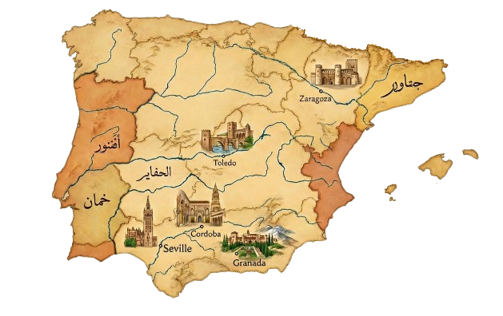
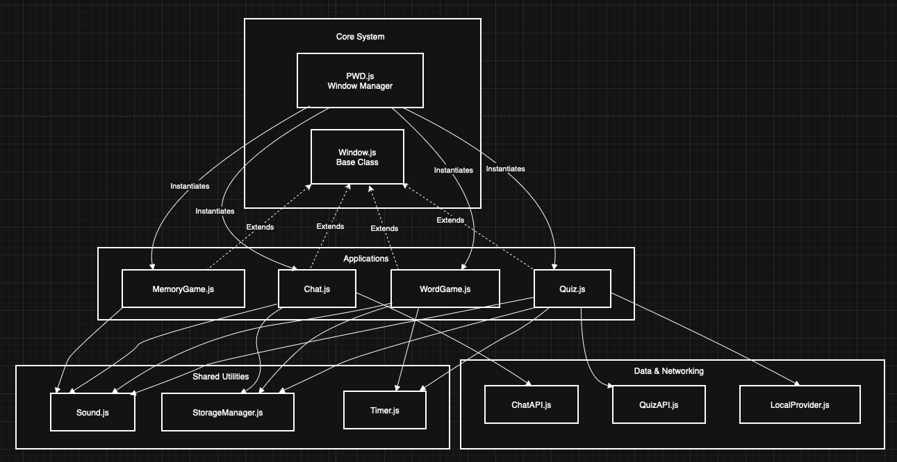

# Al-Andalus SPA (Personal Web Desktop)




## 1. Overview

**Al-Andalus SPA** is a Single Page Application (SPA) that simulates a fully functional desktop environment within the browser. Built entirely with Vanilla JavaScript, it features a custom window manager, a MacOS-style dock, and a suite of integrated applications, all wrapped in a cohesive ["Al-Andalus"](Al-Andalus.md) aesthetic (Sandstone, Emerald, and Gold).

The project demonstrates advanced DOM manipulation, component-based architecture, and asynchronous state management without relying on external UI frameworks.

### 1.1 Table of Contents
* [1. Overview](#1-overview)
* [2. SPA Description](#2-spa-description)
    * [2.1 Project Content](#21-project-content)
* [3. Getting Started](#3-getting-started)
    * [3.1 Setting up the Environment](#31-setting-up-the-environment)
* [4. How to Run](#4-how-to-run)
* [5. Documentation](#5-documentation)
* [6. Features & Highlights](#6-features--highlights)
* [7. Version History](#7-version-history)
* [8. Credits](#8-credits)
* [9. License](#9-license)


## 2. SPA Description

The application acts as an operating system shell. It manages the lifecycle of "windows" (DOM elements), handling z-index stacking, dragging, resizing, and focus management. It allows multiple applications to run simultaneously, preserving their state (like chat history or game progress) even when minimized or backgrounded.

### 2.1 Project Content

The desktop includes four main applications:

1.  **Memory Game:** A tile-matching puzzle with single-player (timer) and two-player (local PvP) modes. Features 3 difficulty levels and 3D card flip animations.
2.  **Chat Channel:** A real-time messaging tool using WebSockets to connect to the university server. Includes custom channel selection, history caching, and user persistence.
3.  **Al-Andalus Quiz:** A time-sensitive trivia game engaging users with history and random code questions. Supports both Online (LNU Server) and Offline (Local JSON) data sources.
4.  **The Caliph's Scroll (Word Game):** An educational "Hangman-style" game. Users decipher terms related to Coding or History while managing hearts and streaks.


## 3. Getting Started

Follow these instructions to get a copy of the project up and running on your local machine.

### Prerequisites
* **Node.js:** (v14 or higher recommended)
* **npm:** (Node Package Manager)

### Installation

1.  **Clone the repository:**
    ```bash
    git clone https://github.com/ashkar99/Desktop-simulating-SPA.git
    cd project folder
    ```

2.  **Install dependencies:**
    ```bash
    npm install
    ```

### 3.1 Setting up the Environment
For detailed instructions on configuring your development environment, please refer to: [**LNU Course Content: HTML, CSS, & JS Dev Tools**](https://gitlab.lnu.se/1dv528/course-content/html-css-javascript-dev-tools)


## 4. How to Run

### Development Mode
Starts a local development server with hot-reload enabled. Perfect for testing changes.
```bash
npm run dev

```

### Production Build

Compiles and minifies the code into the `dist/` folder for deployment.

```bash
npm run build

```

### Preview Production

Serves the built `dist/` folder locally to verify the production build.

```bash
npm run http-server dist

```

*Open your browser and navigate to the address shown in the terminal (usually `http://127.0.0.1:9001`).*


## 5. Documentation

Detailed documentation for the architecture and individual modules can be found here:

* **[Functional Requirements (Summary)](https://www.google.com/search?q=./doc/F-REQUIREMENTS.md)** - *Full list of implemented features (F-Requirments).*
* **[PWD Core System](https://www.google.com/search?q=./doc/PWD.md)** - *Window manager and desktop logic.*
* **[Memory Game](https://www.google.com/search?q=./doc/MEMORY_GAME.md)**
* **[Chat Application](https://www.google.com/search?q=./doc/CHAT_APPLICATION.md)**
* **[Quiz Application](https://www.google.com/search?q=./doc/QUIZ_APPLICATION.md)**
* **[The Scroll (Word Game)](https://www.google.com/search?q=./doc/SCROLL_GAME.md)**
* **[Al-Andalus](Al-Andalus.md)** - *History facts about Al-Andalus and its impact on Eroupean knowledge*

### Dependency Overview


## 6. Features & Highlights

* **Glassmorphism Widgets:** A central clock and wallpaper widget featuring semi-transparent frosted glass effects.
* **Hybrid Focus System:**
    * **Focus-Following:** Windows focus automatically on hover.
    * **Aggressive Restoration:** Prevents focus loss when clicking "dead zones" inside a window.
* **Keyboard Accessibility:** All apps (Quiz, Word Game, Chat) are fully navigable via keyboard (Arrow keys, Enter, Tab).
* **Shared Architecture:** Uses a centralized `StorageManager` and `SoundPlayer` to handle data persistence and audio across all apps efficiently.


## 7. Version History

* **v1.0.0** (2026-01-21)
    * **Core:** Initial release of the Window Manager and Dock environment.
    * **Apps:** Integrated Memory Game, Chat, Quiz, and The Scroll.
    * **System:** Implemented drag/drop logic and persistent storage.


## 8. Credits

**Developer:** Sadek Alashkar
**Icons & Assets:**

* Icons provided by [Flaticon](https://www.google.com/search?q=https://www.flaticon.com/) (Authors: Freepik, Pixel perfect).
* Sound effects from [Mixkit](https://www.google.com/search?q=https://mixkit.co/).
* Images decribed by me and generated by [Gemini](https://gemini.google.com/app) with Banana Nano feature. 
* Diagram design by me with [Mermaid](https://mermaid.js.org) tool.


## 9. License

This project is licensed under the MIT License, see [LICENSE](LICENSE.md) for details.
