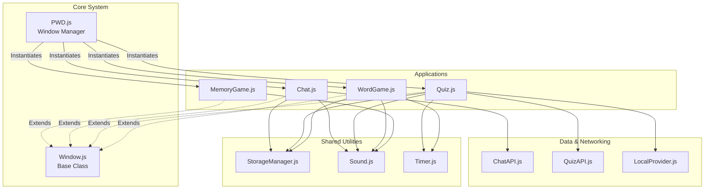

# F-Requirements Summary

### **F1: PWD Functional Requirements**

* **Single Page Application:** The structure uses a single HTML entry point and dynamic module loading.
* **Open Multiple Windows:** `PWD.js` manages a `this.windows` array and allows multiple instances of classes.
* **Drag & Move:** `Window.js` implements full drag-and-drop logic (`#startDrag`).
* **Desktop Icons:** `PWD.js` renders clickable icons that spawn new windows.
* **Close Icon:** `Window.js` adds a standard close button to the header.
* **Focus Management:**
    * *Click/Drag Focus:* Implemented in `#focusWindow` (Z-Index handling).
    * *Top Layer:* The active window properly increments `zIndexCounter`.

* **Included Apps:**
    1. Memory Game
    2. Chat (WebSockets)
    3. Custom App 1 (Quiz)
    4. Custom App 2 (The Scroll / Word Game)

### **F2: PWD Non-Functional Requirements**

* **Visually Appealing:** "Al-Andalus" theme defined in `style.css` (variables, shadows, fonts).
* **ES Modules:** All files use `import`/`export` and clean `Vanilla JavaScript`.
* **JSDoc Comments:** All files are fully commented with JSDoc blocks.
* **Linting:** The code follows standard indentation and formatting rules (StandardJS style).

*Click [here](../doc/PWD.md) for more details*

### **F3: Memory Game Requirements**

* **Multiple Games:** Architecture allows multiple `new MemoryGame()` instances.
* **Keyboard Accessibility:** Implemented via `handleGameKeydown` (Arrow keys + Enter).
* **Extended Feature:** Implemented **Four** extensions:
    * Two-Player Mode (Local Multiplayer).
    * Dynamic Difficulty (Grid Size).
    * Timer (Single Player) & Scoreboard (Two Player).
    * **Audio Feedback:** Sounds for card flips, matching, and victory.

*Click [here](../doc/MEMORY_GAME.md) for more details*

### **F4: Chat Application Requirements**

* **Multiple Instances:** Architecture supports it.
* **Username Entry:** Prompt appears if no username is found in `StorageManager`.
* **Username Persistence:** Saved to `StorageManager` (`pwd-chat-username`).
* **Send Messages:** Textarea and Send button implemented.
* **History (20+ messages):** `StorageManager` caches up to 50 messages per channel.
* **Extended Feature:** See F6 below.

*Click [here](../doc/CHAT_APPLICATION.md) for more details*

### **F5: Additional Window Application (The Quiz)**

* **Custom App:** The **Al-Andalus Quiz** is a fully featured, custom-built application.
    * **Visual Feedback:** Wrong answers trigger an immediate "Game Over" screen with clear options to **Restart** or view the **High Scores**.
    * **Persistent Timer:** A countdown bar is visible at all times during gameplay and changes color (Emerald -> Terracotta) to indicate urgency.
    * **High Score Access:** A dedicated button to view the leaderboard is available from the Start, Game Over, and Victory screens.
    * **Keyboard Accessibility:** The entire game (answering, restarting, navigating menus) is optimized for rapid keyboard play ("The Elevator" focus loop).
    * **Extended Features:**
        * **Hybrid Architecture:** Uses Strategy Pattern to switch between **LNU Server** (Online) and **Local JSON** (Offline).
        * **Difficulty Levels:** Implemented "Hard Mode" which reduces the timer from 10s to 5s.
        * **Segmented Storage:** High scores are saved to separate lists based on difficulty and source (e.g., `quiz-local-hard`).

*Click [here](../doc/QUIZ_APPLICATION.md) for more details*

### **F6: Enhanced Chat (Optional)**

*Requirement: Implement at least 4 enhancements.*

1. **Channel Selection:** Implemented (`switchChannel` / Channel Selector Overlay) with preset and custom rooms.
2. **Caching History:** Implemented (Per-channel storage keys via `StorageManager`).
3. **Change Username:** Implemented (`logout` button resets user session).
4. **Visual Notifications:** Implemented (Header turns red/pulses on new message).
5. **Audio Notifications:** Implemented (Sound plays on background messages).
6. **Input Validation:** Enforces character limits on usernames and channel names. Multi-line message supporter.

### **F7: Additional Enhancements (Optional)**

*Requirement: Enhancements to PWD and Apps.*

* **PWD:**
    * **Desktop Widgets:** Implemented a Central Clock & Wallpaper widget with glassmorphism UI.
    * **Window Resizing:** Custom resize handles implemented in `Window.js`.
    * **Hybrid Focus:** "Focus Following" via mouse hover + Aggressive Focus restoration on background clicks.
    * **Taskbar Animations:** Slide-up reveal on hover.

* **Extra Extra Application: The Scroll (Word Game)**
    - *Click [here](../doc/SCROLL_GAME.md) for more details (Strongly Recommented)*
    * A completely separate Hangman-style game not listed in the basic requirements.
    * **Features:** Dual categories (Code/History), Physical Keyboard capture (`tabindex`), Streak tracking, and "Sudden Death" levels.

* **Shared Architecture (Code Quality):**
    * **StorageManager:** Centralized class for handling all `localStorage` operations (Quiz High Scores, Chat History, Usernames, Word Streaks).
    * **Sound System:** A shared `Sound.js` static class handles audio for all 4 apps, ensuring consistent volume and error handling.
    * **Timer Component:** Extracted `Timer.js` is reused by both Quiz and Word Game to enforce DRY principles.

### **F8: Documentation (Optional)**

*Requirement: Write 15-30 sentences about code structure + 1 diagram.*

## Code Architecture (F8)

The application follows a modular, component-based architecture designed for scalability, reusability, and separation of concerns.

### 1. Core System
* **PWD (Manager):** The central controller that manages the window lifecycle, z-index stacking, and taskbar interactions. It acts as the dependency root, importing and instantiating app classes.
* **Window (Base Component):** A reusable base class that handles DOM creation, dragging, resizing, and focus logic. All four applications (`MemoryGame`, `Chat`, `Quiz`, `WordGame`) extend this class, inheriting uniform behavior.

### 2. Shared Utilities
To adhere to the DRY (Don't Repeat Yourself) principle, functionality used by multiple apps is extracted into standalone modules:
* **StorageManager:** Wraps `localStorage` interaction, providing specific methods for each app (e.g., `getChatHistory`, `saveHighScore`) to prevent key collisions.
* **Sound:** A static utility that standardizes audio playback and error handling across the entire suite.
* **Timer:** A visual countdown component that encapsulates DOM rendering and interval management, shared by the Quiz and Word Game.

### 3. Application Modules
* **Memory Game:** Self-contained logic for grid generation and matching.
* **Chat:** Decouples UI from Networking (`ChatAPI`) and Persistence (`StorageManager`).
* **Quiz:** Uses the **Strategy Pattern** (`QuizAPI` vs `LocalProvider`) to allow seamless offline play.
* **Word Game:** Implements advanced DOM event handling to capture physical keyboard input without focused text inputs.

### 4. Dependency Diagram
*Image: Dependency Diagram*

*Code: Dependency Diagram*

